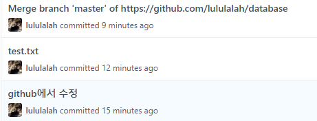

# Git day02

## 1. 포트폴리오 만들기

>  반응형페이지임.

#### startbootstrap

1. [startbootstrap](https://startbootstrap.com/themes/resume/) 레주메 다운로드-압축풀어서

2. 바탕화면에 `C:\Users\student\Desktop\startbootstrap-resume-gh-pages` 아예 폴더만들고 바로 `README` `.gitignore`파일 바로 보이게

3. `index.html` chrome으로 열어서 확인

4. 폴더 빈화면에서 우클릭-`Git bash here`

5. ```bash
   $git init
   #Initialized empty Git repository in C:/Users/student/Desktop/startbootstrap-resume-gh-pages/.git/
   $git add .
   $git commit -m 'Init project'
   ```

6. 폴더 빈화면 우클릭-`open with code`

    * Visual Studio Code: 메모장 상위버전. 텍스트 에디터.개발코드 작성하기 용이
    * Eclipse는 통합개발환경.IDE. 

7. `index.html`

8. ```html
    11줄 <title>HYOJIN Portfolio</title> 
    30줄 <span class="d-block d-lg-none">Hyojin Lee</span>
    66줄    <h1 class="mb-0">HYO JIN
          <span class="text-primary">Lee</span>
    ```
    
9. `크롬-코드검사` 마우스 대면 코드위치를 찾을수 있다. 우클릭-검사 

9. 저장

11. ```bash
     $git add .
     $git status
     $git commit -m 'Edit'
    ```

12. github에서 저장소 만들기 Create a new repository `lululalah/lululalah.github.io`

13. 원격저장소 설정

     ```bash
     $git remote add origin https://lululalah.github.io 
     $git remote -v
     $git push origin master
     ```

14. 프로필이미지 업데이트 `Profile.jpg` `C:\Users\student\Desktop\startbootstrap-resume-gh-pages\img`

15. 소셜링크 수정(인스타그램,깃허브 등)
     이메일수정

      ```html
     74줄   <a href="https://github.com/lululalah">
                  <i class="fab fa-github"></i>
     70줄   <a href="mailto:hyojinlee1007@gmail.com">hyojinlee1007@gmail.com</a>
      ```

16. push     *따로따로 add하기*

      ```bash
      $git status #빨간글씨로 뭐가 바뀌었는지(add할 내용들) 나옴
      $git add img/Profile.jpg
      $git commit -m 'Update profile image' #이미지파일만 따로 커밋
      $git add .
      $git commit -m 'Update social links'
      $git log --oneline #로그를 한줄만 보겠다.
      $git push origin master
      ```

17. 만약 링크에서 새고해도 안되면

      `검사`띄워놓고, `캐시 비우기 및 입력 새로고침` 이용

18. SKILLS수정-203줄 sass를 java로 고쳐보자 

     ```html
    index.html
    203줄	<li class="list-inline-item">
                 <i class="fab fa-java"></i>
     ```

      * 이 아이콘들은 [fontawesome](https://fontawesome.com/)에서 있는 키워드라면 가능하다.

*커밋은 여러번하고 push는 한번만도 가능*
    
19. 컬러변경

```css
resume.css맨끝
.bg-primary {
  background-color: #1c0449 !important;
}

.text-primary {
  color: #1c0449 !important;
}

a {
  color: #2c0c66;
}

a:hover, a:focus, a:active {
  color: #8249b8ce;
}
 

   ```html
index.html 22줄
`css/resume.css`로수정
```


*html로 미리 본다고 생각, push하면 원격에도 업데이트 됨*


## 2. 집에서도 복습하기

> $git init <=> $git clone 연결해서 생각하자! (push랑 clone이랑 층 다름.):한번씩, 맨처음에만 하는것.
>
> clone-저장소를 집으로 가져온다.
>
> push(작업 완료후)<-> pull(작업 시작전)

 #### 멀캠-1 init

1. 바탕화면에 `데이터베이스` 폴더

2. `데이터베이스 설치법.txt` 파일생성

3. ```bash
   <멀캠(데이터베이스폴더)>
   $git init
   $git touch a.txt
   $git add .
   $git commit -m '멀캠-데이터베이스 설치법'
   ```

4. github에 `저장소`만들기(new repository)

   1. Repository name은 `database`로 지정
   2. 3가지 옵션. 중 2번째: 기존의 저장소에 올리고 싶다.라는 뜻.복붙해서 멀캠 Bash에.

   ```bash
   student@M16021 MINGW64 ~/Desktop/데이터베이스 (master)
   $ git remote add origin https://github.com/lululalah/database.git
   
   student@M16021 MINGW64 ~/Desktop/데이터베이스 (master)
   $ git push -u origin master
   ```


####    **집-1**(우리는 데스크탑에 `집`폴더라고 가정) clone

1. `Git Bash here`

2. database github 에서 `clone` -url 복사

3. ```bash
$git clone {https://github.com/lululalah/database.git}
   $cd database/ #다운받은 폴더가 생기고 거기로 이동한다.
   #모르겠으면 집 폴더에서 다시 'Git Bash here'
   ```
   
4. 집폴더에 `database `폴더가 생김
    `데이터베이스 설치법`파일 수정

   ```bash
   $git status
   $git add .
   $git commit -m '집-복습'
   $git push origin master
   ```

----

#### 멀캠-2

1. 멀캠도착

   ```bash
   $git pull origin master
   ```

2. 멀캠작업

3. ```bash
   $git add .
   $git commit -m '멀캠-수정'
   ```

4. 멀캠퇴근

   ```bash
   $git push origin master
   ```


#### 집-2

1. 집 도착

   ```bash
   $git pull origin master
   ```

2. 집 작업(집-database폴더-데이터베이스 설치법 수정)

3.    ```bash
   $git add .
   $git commit -m '집-수정'
   ```
   
4. 집나가기

   ```bash
   $git push origin master
   ```

----

#### 멀캠-3,집-3 반복


## 3. 오류해결

#### Github에서 수정-충돌상황발생

> 서로다른 이력을 갖고 있을 때 push가 안된다.
>
> Github의 변경사항을 로컬에 pull하고 나서 *하나의 흐름으로* 다시 만든 후에 push해줘.

1. database저장소에서 `create new file`하고 commit (웹상에서)

   ​	* 이때 메시지는 **`github에서 수정`** 이라고 작성했음.

2. **test.txt** 로컬에서 만들기
   
   ```bash
   <멀캠>
   $touch test.txt
   $git status
   $git add .
   $git commit -m 'test.txt'
$git push origin master
   ```
   
3. 오류발생

   ```bash
   $ git push origin master
   
   To https://github.com/edutak/database.git
    ! [rejected]        master -> master (fetch first)
   error: failed to push some refs to 'https://github.com/edutak/database.git'
   
   # 원격저장소의 작업 내용(work - commit)과 로컬 내용이 다르다.
   hint: Updates were rejected because the remote contains work that you do
   hint: not have locally. This is usually caused by another repository pushing
   
   # 원격 저장소 변경사항(changes)을 통합하고 다시 push 해라.
   # 예) git pull ...
   hint: to the same ref. You may want to first integrate the remote changes
   hint: (e.g., 'git pull ...') before pushing again.
   hint: See the 'Note about fast-forwards' in 'git push --help' for details.
   ```

   * **해쉬값**:각각의 커밋이 고유의 값을 갖게. (숫자랑 알파벳 일곱자리)
   * *주의: 커밋 메시지가 커밋을 구분하는 게 아니다.

4. 해결방법

   **이 메시지를 보게 된다면, 로컬에서 `git log` , 원격 저장소(github)의 커밋 이력들을 확인하고 다른 부분을 체크하자!!**

   ```bash
   $git pull origin master
   ```

5. VIM이 나오는데 나가기

   ​	esc누르고 `:wq`

6. **Merge**됨.

   ```bash
   $git push origin master
   ```

   


## 4. 브랜치

> 개발시 서로의 코드가 독립적으로 돌아가게.
>
> 각각의 독립된 개발환경을 보장한다.

[강의자료다운로드](https://bit.do/github-flow)

##### Git Flow

1. 마스터브랜치: 지금 돌아가는, 배포가능한 코드
2. develop branch: 다음버전을 위한 개발상태
3. 각각의 기능별. ex)네이버페이,메일 등등
4. 다시 모으기, -오류발생-release branch
5. 신규패치 반영 master branch
6. hotfix branch

#### 이론. 일단 로컬에서만 실습

###### feature/index

바탕화면에 네이버 폴더 만들기-`Git Bash here`

 ```bash
   $git init
   $touch README.md
   $git add .
   $git commit -m 'Add README'
 ```

1. 브랜치생성
   
   ```bash
   $git branch feature/index #브랜치1개 생성
   $git branch #브랜치 목록보기
   	  feature/index
   	* master
   ```
   
2. 브랜치 이동 -checkout

   ```bash
   $git checkout feture/index
   #master 브랜치가 feature/index브랜치로 이동
   #Switched to branch 'feature/index'
   ```

3. 파일생성(개발을 완료했다는 의미..)

   ```bash
   $touch index.html
   $touch index.css
   ```

4. commit 후 master이동

   ```bash
   $git status
   $git add .
   $git commit -m 'Complete index page'
   $git log --oneline
   $git checkout master #다시 master브랜치로 이동
   ```
   
5. merge-다시 가져오기(master에 반영)

   ```bash
   $git merge feature/index
   $git log --oneline
	```

6. 브랜치 지우기

   ```bash
   $git branch -d feature/test
   ```


#### 실습-상황 1,2,3

1. fast-forward
2. merge commit
3. merge commit 충돌

[브랜치 시나리오 다운로드](http://bit.do/git-branch) 참고

[브랜치 시나리오 실습](C:\Users\student\Desktop\TIL\Git day02-브랜치 시나리오) 파일 참고


## 5. Github에서 협업하기-pull request

> 내 브랜치 자체를 Github에 올려놓고
>
> pull request하고 더 잘하는 사람이 master에 `merge`함.

1. 바탕화면 `데이터베이스`폴더에서 `Git Bash here`

2. ```bash
   $git staus
   $touch db.txt
   $git add .
   $git commit -m 'Merge pull request'
   ```

3. `GitHub`들어가서 `Compare and pull request` `Open a pull request`

   내꺼 다 개발했으니까 반영해주세요.

   상세하게 정리 ex)db설계 반영, table...
   `create pull request`

   ​	이 위의 반영은 보통 사수가 함.

   충돌발생안한다. 체크하고 `confirm merge`

4. commit 확인

   `Merge pull request `

####  1) Collaborator등록

###### 끝말잇기

> push권한 O

파일확인

1. Github에서`repository` 저장소만들기  `end_to_end`

2. `Settings`-`collaborators`

3. `copy invite link`

4. `끝말잇기`에서 `Git Bash here`

   ```bash
   $
   ```

#### 2) Fork

###### n행시 백일장

> 해당 저장소에 push할 권한이 없을때. 
>
> 오픈소스 참여할때

1. Fork로 내 저장소로 가져오기.

   ​	edutak/1001에서 `Fork`

2.  clone

   ​	내 저장소에 갔더니 `1001` 저장소가 연결되어있음.-`Forked from edutak/1001`

   ​	lululalah/1001 들어가서 `clone or download`

   ​	나는 n행시 폴더를 아예 바탕화면에 만들었지만 `git Bash here`해서

   ```bash
   $git clone {https://github.com/lululalah/1001.git}
   $cd 1001/ #다운받은 폴더가 생기고 거기로 이동한다.
   ```

3. 1001폴더에서

   `README`수정 저장

4. add, commit

   ```bash
   $git add .
   $git commit -m 'LHJ'
   ```

5. *내 저장소*로 push

   ```bash
   $git push origin master
   ```

6. github들어가서 베이스가 되는 저장소(edutak)로 pull request


참고 [오픈소스 커뮤니티-스프린터](https://www.sprintseoul.org/)


# 마크다운 기반 블로깅

> 정적 템플릿 생성기
> :mardown~~>html/css바꿔준다.

### Jekyll

꽤 오래됨. 레퍼런스 많음 카카오 기술블로그 기반

### Gatsby

최신 프레임워크. github octoverse 기준으로 2019년 가장 많이 성장한 오픈소스 프로젝트 TOP10에 들정도로 고속성장

최근 웹 트렌드 기술(react, graphql)반영 되어 있음

​    