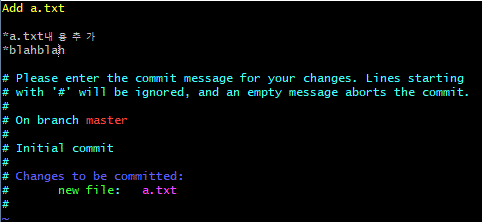
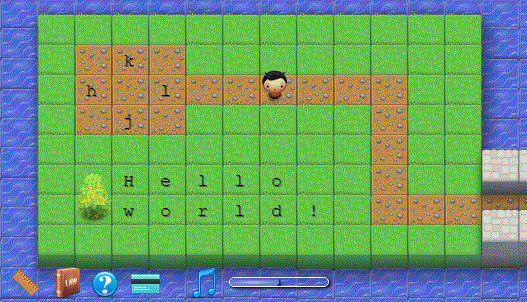

# Git day 03

## 1. Git status & undoing

#### commit

먼저 `git_plus` 폴더 만들고 `Git Bash here` `$git init`

1. WD O, staging area X인데 커밋을 하려고 시도

   ```bash
   $ touch a.txt
   $git commit
   nothing added to commit but untracked files present
   #commit할 것이 없지만, =staging area가 비어있음
   #untracked file이 있다. =네가 작업 했지만 git commit 이력에 담기지 않은 파일있다.
   ```

2. `a.txt`를 폴더에서 걍 지우면

   WD X 에서도 없어짐. , 
staging area X 에는 물론없고.
   
   ```bash
   $git commit
   nothing to commit
   #어떠한 변경 사항도 없다.
   ```
```
   
메모장확인
   


```


### 3. commit메시지 작성하기

> 부제: VIM활용기초

1. 메시지 없이 commit하면

```bash
$git commit #뒤에-m''없이

VIM이 나온다.
# Please enter the commit message for your changes. Lines starting
# with '#' will be ignored, and an empty message aborts the commit.
#
# On branch master
#
# Initial commit
#
# Changes to be committed:
#       new file:   a.txt
#
```



* 편집(입력)모드: `VIM`창에서 `i`
  
  * 문서편집가능 (위 캡쳐에서 상위3줄 추가했음.)
  
* 명령모드: `esc` 누르고
  * `dd` : 해당 줄 삭제
  * `:wq` : 저장 및 종료
    * `w` :write
    * `q` : quit
  * `:q!` : 강제종료
    * `q` : quit
    * `!` : 강제
    
    

참고 [VIM배우기 게임](https://vim-adventures.com)

​		[좋은 git커밋 메시지를 작성하기 위한 7가지 약속](https://meetup.toast.com/posts/106)

상하좌우 방향키 등을 익힐 수 있다. 




2. 만약 VIM에서 커밋메시지를 수정하지 않거나

   저장하지 않고 나갔다면, 직접입력해야한다.

   ```bash
   $git commit -m 'commit message'
   ```

   * 커밋 메시지는 항상 해당 작업 이력을 나타낼 수 있도록 작성하기
   * 일관적인 포맷으로 작성하려고 노력하기

   

### log로 확인하기

> 커밋은 해시값(hash value)에 의해서 구분된다.
>
> SHA-1 해시 알고리즘을 사용하여 표현한다.

해시값: 어떤 값을 넣었을 때, 대응 되는 값이 나옴.(DB에는 암호화해서 저장)

```bash
$git log
commit c62a5f293b90da317538b12e873ad17499761ce7 (HEAD -> master)
Author: lululalah <hyojinlee1007@gmail.com>
Date:   Wed Dec 18 09:41:50 2019 +0900

    Add a.txt

    *a.txt내용추가
    *blahblah
```

```bash
$git log --oneline
c62a5f2 (HEAD -> master) Add a.txt
$git log-1
$git log --oneline --graph
$git log -1 --oneline
```


### ## 2. commit undoing

1. 커밋 메시지만 수정

    ```bash
    $git commit --amend #직전 commit만을 바꿀수 있음.
    ```
    
    하면 VIM이 나옴. (`i`로 수정)	
    
    * 커밋 메시지 수정하면-> 해시값이 변경되므로, 다른 이력으로 관리됨

​	*  **따라서, 공개된 저장소(원격저장소)에 이미 push된경우 커밋메시지를 절대 수정해서는 안된다.**

2. 특정파일 추가하기

   * `c.txt`파일을 같이 커밋 하려고 했는데, 그건 add하지 않고 커밋 해버린경우
   * 메시지 작성 시점 자체를 `staging area`를 뒤로 돌림.
   * 포토샵으로 사진에 추가하는게 아니고, 사진 찍던 시점에 직접 사람을 불러옴.

   ```bash
   $git add c.txt
   $git commit --amend #이후에 VIM나와서 커밋메시지 추가할 수 있음.
   ```


### 6. Staging area(방향바꾸기)

1. 커밋 이력이 있는 파일을 수정하는 경우

   * 변경사항이 있는데 그 변경사항이 WD에는 있고 SA에는 없는경우

   * $git add로 SA(staging area)로 보낼 수 있다.
   * 일단 unstage하기 위해서는(SA에서 제외하기 위해서는) `$git restore`

   ###### 강사님 파일 확인할것.

   ```bash
   $git restore --staged a.txt #언스테이지 해줌. 다시 SA->WD로.
   ```


### 7. add 취소하기

```bash
$git restore --staged <file>
```

* 구버전의 git에서는 아래의 명령어 사용

  ```bash
  $git reset HEAD <file>
  ```


### 8.  WD변화 삭제하기

> git에서는 모든 commit시점으로 되돌릴 수는 있다.
>
> 다만, WD를 삭제해버리면 되돌릴 수가 없다.

* 누가 다 파일을 폴더에서 삭제했더라도, 커밋만 잘 해놓았더라면,

    ```bash
    $git status 로 확인해보니
            deleted:    a.txt
            deleted:    b.txt
    ```

* 전 커밋으로 돌아가기 위한 명령어
커밋시점 간 *변화상태*를 비교해서 돌려줌. (바뀐것만 역산)
  
  ```bash
  $git restore
  ```
```

* *커밋하는 시점: 개발을 다 완료한 시점, 작업 도중X*

* 구버전 git에서는 아래의 명령어 사용

  ```bash
  $git checkout -- <file>
```

  

## stash

> 변경사항을 임시로 저장 해놓는 공간
>
> 마지막 커밋 시점으로 되돌려준다. 

> 지금 작업하는 거 개발 전부 완료=commit
>
> commit하기는 아깝고 지우기도 아까울때 = stash

1. feature branch에서 a.txt 변경 후 커밋

   ```bash
   $git add .
   $git commit -m 'Edit feature branch'
   ```

2. master branch에서 `a.txt`수정(add나 commit없이)

3. WD에 있는 상태(=아직 이력이 아님.실선가지X점선가지O)에서 merge

   ```bash
   $git merge feature
   #following file: 저쪽에서 넘어오려는 파일이 a.txt에 병합될 것 같다. 네 변화사항을 commit하거나(실선으로 만들거나) 그 파일들을 stash해라.
   ```

   stash저장

   ```bash
   $git stash
   Saved working~ index(=SA)
   #지금 작업 사항을 잠시 옮겨둠.
   ```

   stash목록

   ```bash
   $git merge feature
   $git stash list #목록보기
   stash@{0}
   ```

   stash 불러오기

   ```bash
   $git stash pop #불러오기 + 목록에서 삭제
   # $git stash apply #불러오기
   # $git stash pop #목록에서 삭제
   ```

   

4. 해결

   ```bash
   $git stash #임시공간저장
   $git merge feature #병합
   $git stash pop #임시공간에서 불러오기
   #충돌발생, 메모장에서 직접 해결 후 작업 이어가기!! 그 다음 다 끝나면 commit
   ```


## Reset vs Revert

#### reset

> 내가 한 커밋을 지워버리고 싶거나
>
> 돌아가고 싶은 커밋시점(@)이 있다면(log oneline으로 해쉬값 확인후)

@=====@=====@였다면,

```bash
$git reset 해쉬코드
#이건 원래 실선을 점선으로 돌리는(WD로) 의미
# @===실선===@----점선(WD로)---@
#이후 변경 사항을 WD에 유지시켜줌
```

```bash
$git reset --hard 해쉬코드
#마스터 변경사항 아예 삭제. 그 이후의 역사가 아예 다 사라짐
# @===실선===@~여기는 아예 삭제
```

```bash
$git reset --soft 해쉬코드
# 처음에 @=====@======@-----(WD)일때
# @======@-----/-----
#지금 작업하고 있는 내용 및 변경사항을 WD에 유지시켜줌
```

* 주의!! 공개된 저장소에 push된 이력은 절대 reset하지 않는다.


#### revert

> 해당 커밋시점으로 되돌렸다는 사실을 이력달아줌.
>
> 상태는 reset과 똑같이 되돌려주지만,

@=====@=====@(되돌리고 싶은 시점)----이력남는다.----@

```bash
$git revert 해시코드
```

VIM편집기창 뜸=revert commit 커밋메시지 작성해라

